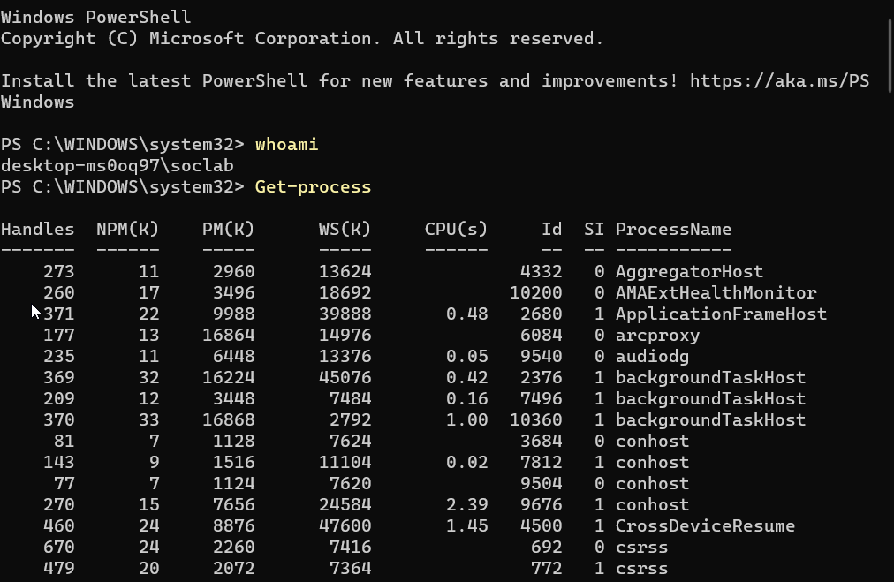
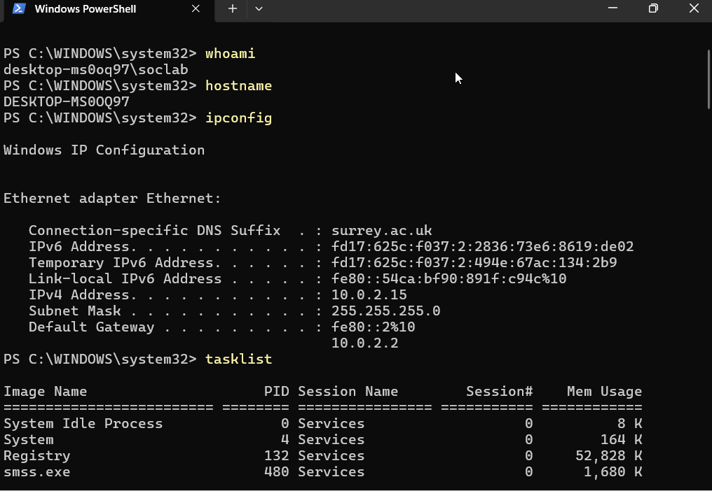
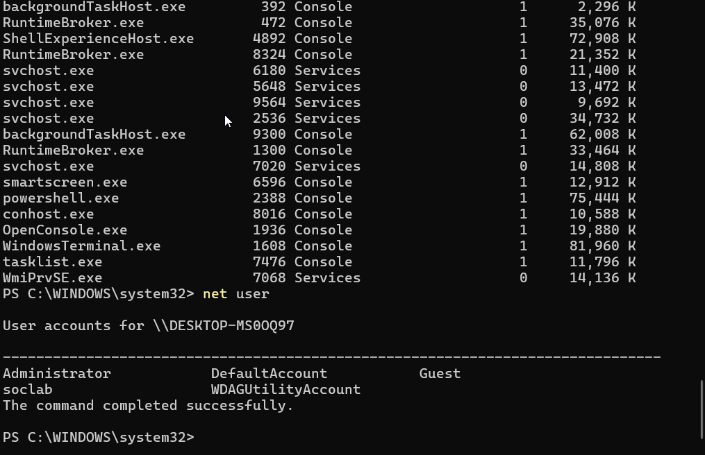

# WindowsSOC-Detection-Lab

A hands-on Windows SOC Detection Lab built using Sysmon and Microsoft Sentinel for threat detection, attack simulation, telemetry analysis, and behavioral detection engineering.

This project simulates realistic attacker techniques on a Windows 11 virtual machine and investigates the generated telemetry using Microsoft Sentinel and KQL.

---

# Project Overview

This lab was created to strengthen practical SOC analysis and detection engineering skills by simulating attacker behavior and analyzing endpoint telemetry.

The environment focuses on:
- Windows telemetry collection
- Sysmon monitoring
- Microsoft Sentinel integration
- Threat hunting using KQL
- Behavioral detection engineering
- Persistence detection
- Reconnaissance analysis
- Attack simulation workflows

---

# Lab Architecture

```text
Windows 11 VM
↓
Sysmon
↓
Windows Event Logs
↓
Azure Monitor Agent
↓
Azure Arc
↓
Data Collection Rules
↓
Log Analytics Workspace
↓
Microsoft Sentinel
↓
KQL Detection & Threat Hunting
```

---

# Technologies Used

| Technology | Purpose |
|---|---|
| Windows 11 VM | Attack simulation environment |
| Sysmon | Endpoint telemetry collection |
| Microsoft Sentinel | SIEM platform |
| Azure Arc | Onboarding local VM into Azure |
| Azure Monitor Agent | Telemetry forwarding |
| Log Analytics Workspace | Centralized log storage |
| KQL | Threat hunting and detections |
| PowerShell | Attack simulation |

---

# Attack Simulations

## 1. PowerShell Execution Detection

Simulated PowerShell execution activity and validated Sysmon Event ID 1 telemetry collection.

### Attack Simulation



### Detection Example


---

## 2. Encoded PowerShell Detection

Simulated Base64 encoded PowerShell execution commonly associated with attacker obfuscation techniques.

### Attack Simulation


### Detection Example


---

## 3. Registry Persistence Detection

Simulated Windows Run Key persistence using registry modifications.

### Attack Simulation


### Detection Example


---

## 4. Scheduled Task Persistence Detection

Simulated scheduled task persistence using schtasks.exe.

### Attack Simulation


### Detection Example


---

## 5. Reconnaissance Activity Detection

Simulated attacker reconnaissance behavior using common Windows discovery commands.

### Commands Executed

```powershell
whoami
hostname
ipconfig
tasklist
net user
```

### Attack Simulation





### Detection Example


---

# Detection Engineering

The lab focuses on behavioral detection engineering instead of simple signature-based detections.

Detection logic includes:
- Encoded PowerShell execution
- Registry persistence
- Scheduled task persistence
- Reconnaissance activity
- Suspicious PowerShell behavior
- Parent-child process analysis

---

# Example KQL Queries

## Encoded PowerShell Detection

```kql
Event
| where Source == "Microsoft-Windows-Sysmon"
| where EventID == 1
| where RenderedDescription has_any ("-enc","EncodedCommand")
| sort by TimeGenerated desc
```

---

## Registry Persistence Detection

```kql
Event
| where Source == "Microsoft-Windows-Sysmon"
| where EventID == 13
| where RenderedDescription has "CurrentVersion\\Run"
| sort by TimeGenerated desc
```

---

## Reconnaissance Detection

```kql
Event
| where Source == "Microsoft-Windows-Sysmon"
| where EventID == 1
| where RenderedDescription has_any ("whoami.exe","hostname.exe","ipconfig.exe","tasklist.exe","net.exe")
| sort by TimeGenerated desc
```

---

# Sysmon and Sentinel Integration

## Azure Arc Connected Machine


---

## Sentinel Sysmon Telemetry


---

# Repository Structure

```text
WINDOWSSOC-DETECTION-LAB/
│
├── architecture/
├── attack-simulations/
├── detection-rules/
├── documentation/
├── kql-queries/
├── logs-analysis/
├── screenshots/
├── sysmon-config/
└── README.md
```

---

# Key Skills Demonstrated

- SOC Operations
- Threat Hunting
- Detection Engineering
- Microsoft Sentinel
- KQL Querying
- Sysmon Analysis
- Windows Telemetry
- Behavioral Analytics
- Persistence Detection
- Process Correlation
- Security Monitoring

---

# MITRE ATT&CK Techniques Covered

| Technique ID | Technique |
|---|---|
| T1059.001 | PowerShell |
| T1027 | Obfuscated/Encoded Files and Information |
| T1547.001 | Registry Run Keys / Startup Folder |
| T1053.005 | Scheduled Task |
| T1033 | System Owner/User Discovery |
| T1082 | System Information Discovery |
| T1016 | System Network Configuration Discovery |
| T1057 | Process Discovery |
| T1087 | Account Discovery |

---

# Learning Outcomes

Through this project I learned:
- How endpoint telemetry flows into a SIEM
- How Sysmon improves Windows visibility
- How attackers establish persistence
- How behavioral detections are engineered
- How to investigate suspicious process activity
- How to analyze PowerShell telemetry
- How to build KQL hunting queries
- How SOC analysts investigate attacker behavior

---

# Future Improvements

Potential future enhancements:
- Sigma rule conversion
- Automated Sentinel analytics rules
- MITRE ATT&CK dashboards
- Defender for Endpoint integration
- Additional attack simulations
- Automated alerting workflows

---

# Disclaimer

This project was created for educational and defensive security purposes only.

All attack simulations were performed in an isolated lab environment.
