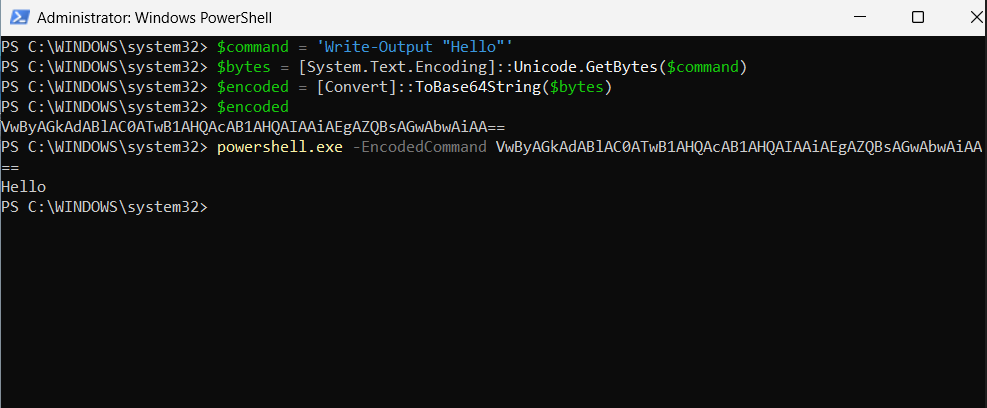

# Encoded PowerShell Attack Simulation

## Overview

This attack simulation demonstrates the execution of Base64-encoded PowerShell commands within the Windows SOC Detection Lab.

The objective was to simulate suspicious PowerShell behavior commonly observed during real-world attacks and validate Sysmon and Microsoft Sentinel detection capabilities.

---

# Simulation Objective

The purpose of this simulation was to:
- Generate suspicious PowerShell telemetry
- Simulate encoded command execution
- Validate Sysmon Event ID 1 logging
- Detect encoded PowerShell activity using KQL
- Practice threat hunting workflows

---

# Encoded PowerShell Generation

The following commands were used to generate a valid UTF-16LE Base64-encoded PowerShell payload:

```powershell
$command = 'Write-Output "Hello"'
$bytes = [System.Text.Encoding]::Unicode.GetBytes($command)
$encoded = [Convert]::ToBase64String($bytes)
$encoded
```

Generated payload:

```text
VwByAGkAdABlAC0ATwB1AHQAcAB1AHQAIAAiAEgAZQBsAGwAbwAiAA==
```

---

# Encoded PowerShell Execution

The encoded payload was executed using:

```powershell
powershell.exe -EncodedCommand VwByAGkAdABlAC0ATwB1AHQAcAB1AHQAIAAiAEgAZQBsAGwAbwAiAA==
```

Expected output:

```text
Hello
```

---

# Attack Simulation Screenshot



---

# Why Encoded PowerShell Matters

Attackers frequently abuse encoded PowerShell commands to:
- Obfuscate malicious activity
- Evade simple detections
- Hide command-line content
- Execute payloads stealthily

SOC analysts commonly hunt for:
- `-enc`
- `-EncodedCommand`

within process creation telemetry.

---

# Telemetry Source

The simulation generated:
- Sysmon Event ID 1 logs
- PowerShell process creation telemetry
- Command-line execution details

Telemetry was forwarded into Microsoft Sentinel using:
- Azure Monitor Agent
- Azure Arc
- Data Collection Rules

---

# MITRE ATT&CK Mapping

| Technique | Description |
|---|---|
| T1059.001 | PowerShell |
| T1027 | Obfuscated/Encoded Files and Information |

---

# Skills Demonstrated

- PowerShell Monitoring
- Encoded Command Analysis
- Sysmon Telemetry Analysis
- Microsoft Sentinel
- Threat Hunting
- Detection Engineering
