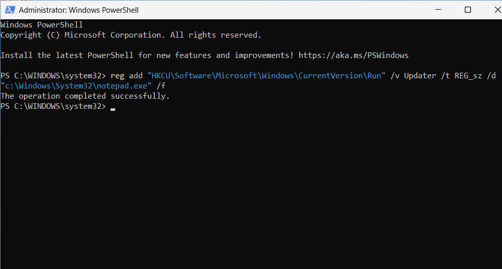

# Registry Persistence Attack Simulation

## Overview

This attack simulation demonstrates registry-based persistence using Windows Run Keys within the Windows SOC Detection Lab.

The objective was to simulate persistence behavior commonly abused by attackers and validate Sysmon registry monitoring and Microsoft Sentinel visibility.

---

# Simulation Objective

The purpose of this simulation was to:
- Generate registry persistence telemetry
- Simulate attacker persistence behavior
- Validate Sysmon Event ID 13 logging
- Practice persistence detection workflows
- Investigate registry modification telemetry in Sentinel

---

# Registry Persistence Command

The following command was executed inside the Windows VM:

```powershell
reg add "HKCU\Software\Microsoft\Windows\CurrentVersion\Run" /v Updater /t REG_SZ /d "C:\Windows\System32\notepad.exe" /f
```

---

# Command Breakdown

| Component | Description |
|---|---|
| HKCU\Software\Microsoft\Windows\CurrentVersion\Run | Registry Run Key location |
| Updater | Registry value name |
| REG_SZ | String registry type |
| notepad.exe | Program configured to execute during user logon |

---

# Attack Simulation Screenshot



---

# Why Registry Persistence Matters

Attackers commonly abuse Run Keys to:
- Maintain persistence after reboot
- Automatically execute malware
- Re-establish access
- Launch malicious payloads during login

Registry persistence is frequently associated with:
- Malware
- RATs
- Loaders
- Credential stealers
- Post-exploitation activity

---

# Expected Telemetry

This activity should generate:
- Sysmon Event ID 13
- Registry modification telemetry
- Process execution metadata
- User context information

Telemetry is forwarded into Microsoft Sentinel using:
- Azure Monitor Agent
- Azure Arc
- Data Collection Rules

---

# MITRE ATT&CK Mapping

| Technique | Description |
|---|---|
| T1547.001 | Registry Run Keys / Startup Folder |

---

# Skills Demonstrated

- Persistence Simulation
- Windows Registry Analysis
- Sysmon Monitoring
- Microsoft Sentinel
- Threat Hunting
- Detection Engineering
