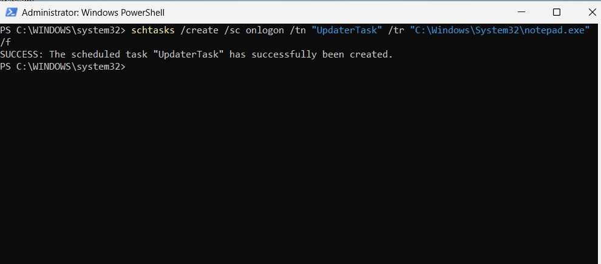

# Scheduled Task Persistence Attack Simulation

## Overview

This attack simulation demonstrates scheduled task persistence within the Windows SOC Detection Lab.

The objective was to simulate persistence behavior commonly abused by attackers and validate Sysmon and Microsoft Sentinel visibility into scheduled task creation activity.

---

# Simulation Objective

The purpose of this simulation was to:
- Generate scheduled task persistence telemetry
- Simulate attacker persistence behavior
- Validate Sysmon process creation logging
- Practice persistence detection workflows
- Investigate scheduled task activity in Microsoft Sentinel

---

# Scheduled Task Creation Command

The following command was executed inside the Windows VM:

```powershell
schtasks /create /sc onlogon /tn "UpdaterTask" /tr "C:\Windows\System32\notepad.exe" /f
```

---

# Command Breakdown

| Component | Description |
|---|---|
| /create | Create a new scheduled task |
| /sc onlogon | Trigger task during user logon |
| /tn "UpdaterTask" | Scheduled task name |
| /tr notepad.exe | Program executed during login |
| /f | Force overwrite if task already exists |

---

# Attack Simulation Screenshot



---

# Why Scheduled Tasks Matter

Attackers commonly abuse scheduled tasks to:
- Maintain persistence after reboot
- Execute malware automatically
- Re-establish access
- Launch payloads silently

Scheduled tasks are frequently associated with:
- Malware persistence
- Ransomware operations
- Remote access trojans
- Post-exploitation frameworks
- Red team activity

---

# Expected Telemetry

This activity should generate:
- schtasks.exe process execution
- Sysmon Event ID 1 telemetry
- Command-line execution visibility
- Process metadata
- User context information

Telemetry is forwarded into Microsoft Sentinel using:
- Azure Monitor Agent
- Azure Arc
- Data Collection Rules

---

# MITRE ATT&CK Mapping

| Technique | Description |
|---|---|
| T1053.005 | Scheduled Task |

---

# Skills Demonstrated

- Persistence Simulation
- Scheduled Task Monitoring
- Sysmon Analysis
- Microsoft Sentinel
- Threat Hunting
- Detection Engineering
