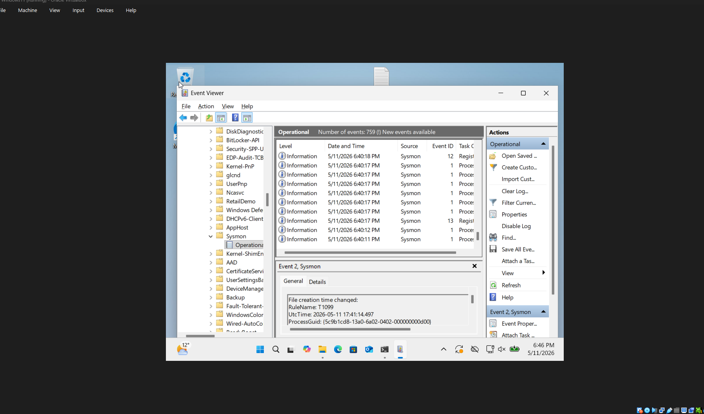
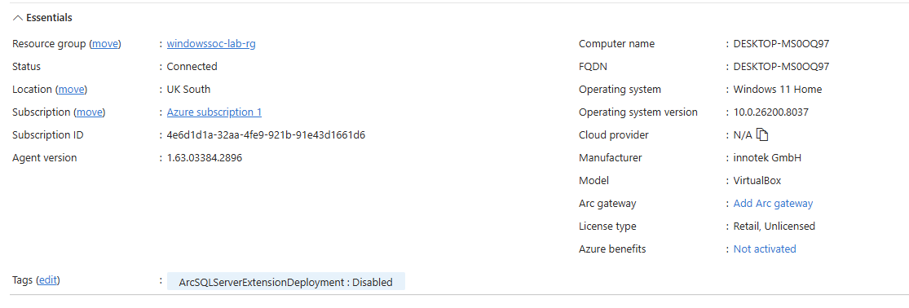
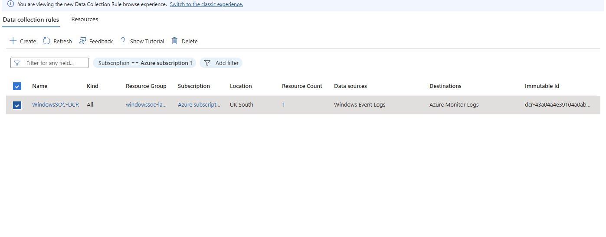
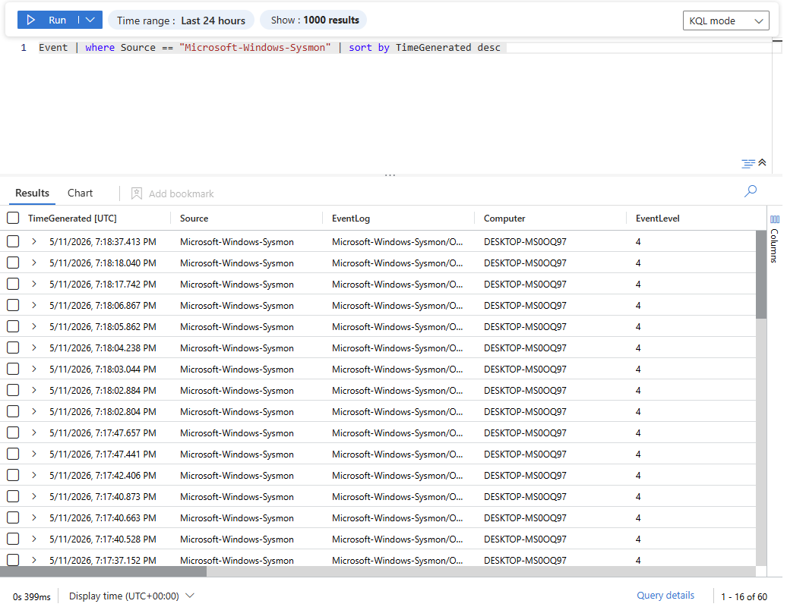

# Sysmon to Microsoft Sentinel Integration

## Objective

The goal of this setup was to collect Windows Sysmon telemetry from a local Windows 11 virtual machine and ingest it into Microsoft Sentinel for centralized monitoring and detection engineering.

---

## Technologies Used

- Windows 11 VM
- Sysmon
- SwiftOnSecurity Sysmon Configuration
- Azure Arc
- Azure Monitor Agent (AMA)
- Data Collection Rule (DCR)
- Microsoft Sentinel
- KQL

---

# Architecture

Windows 11 VM  
↓  
Sysmon  
↓  
Windows Event Logs  
↓  
Azure Monitor Agent  
↓  
Log Analytics Workspace  
↓  
Microsoft Sentinel

---

# Step 1 — Sysmon Installation

Sysmon was installed using the SwiftOnSecurity configuration to improve endpoint telemetry visibility and reduce unnecessary logging noise.

## Installation Command

```powershell
.\Sysmon64.exe -accepteula -i sysmonconfig-export.xml
```

## Screenshot — Sysmon Operational Logs



---

# Step 2 — Azure Arc Onboarding

The Windows VM was onboarded into Azure Arc to allow Azure to manage the local machine and apply monitoring configurations.

After onboarding:

- VM appeared in Azure Arc
- Azure Monitor Agent became manageable
- DCR association became possible

## Screenshot — Azure Arc Connected Machine



---

# Step 3 — Data Collection Rule Configuration

A custom Data Collection Rule (DCR) was created to collect the following logs:

- Microsoft-Windows-Sysmon/Operational
- Security logs

Destination:

- Log Analytics Workspace connected to Microsoft Sentinel

## Screenshot — DCR Deployment



---

# Step 4 — Microsoft Sentinel Log Ingestion

Sysmon logs were successfully ingested into Microsoft Sentinel using Azure Monitor Agent and Azure Arc integration.

## KQL Validation Query

```kql
Event
| where Source == "Microsoft-Windows-Sysmon"
| sort by TimeGenerated desc
```

## Screenshot — Sentinel Sysmon Logs



---

# Result

Sysmon logs were successfully ingested into Microsoft Sentinel and validated through KQL queries.

This confirmed:

- Sysmon telemetry generation
- Azure Monitor ingestion
- DCR configuration
- Sentinel visibility
- End-to-end log pipeline functionality

---

# Skills Demonstrated

- Windows Endpoint Monitoring
- SIEM Configuration
- Microsoft Sentinel Integration
- Azure Arc Onboarding
- KQL Querying
- Telemetry Engineering
- Log Ingestion Validation
- Windows Security Monitoring
