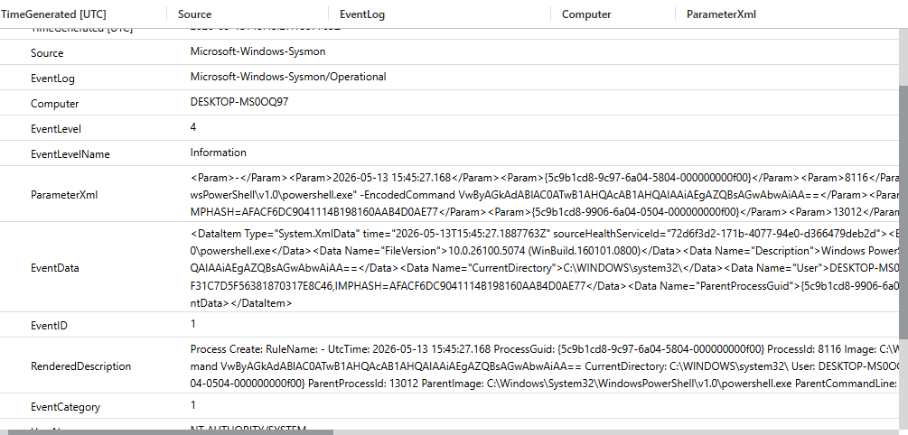

# Encoded PowerShell Telemetry Analysis

## Overview

This investigation analyzes encoded PowerShell execution telemetry collected using Sysmon and Microsoft Sentinel within the Windows SOC Detection Lab.

The objective was to understand how encoded PowerShell activity appears in centralized Windows telemetry and how SOC analysts can investigate suspicious command-line behavior.

---

# Investigation Query

The following KQL query was used during the investigation:

```kql
Event
| where Source == "Microsoft-Windows-Sysmon"
| where EventID == 1
| where RenderedDescription has_any ("-enc","EncodedCommand")
| sort by TimeGenerated desc
```

---

# Investigation Screenshot



---

# Telemetry Observed

The investigation identified:
- powershell.exe execution
- encoded command-line arguments
- Base64 payload visibility
- process execution metadata
- timestamps
- endpoint hostname information
- parent-child process relationships

The telemetry confirmed that Sysmon Event ID 1 successfully captured encoded PowerShell activity.

---

# Important Telemetry Fields

## Image

The `Image` field identified the executed binary:

```text
powershell.exe
```

This confirmed PowerShell execution activity.

---

## CommandLine

The `CommandLine` field exposed:
- `-EncodedCommand`
- Base64 payload content

This field is extremely valuable during threat hunting and incident investigations.

---

## ParentImage

The `ParentImage` field identified the parent process responsible for launching PowerShell.

Parent-child relationships are critical during investigations because suspicious parent processes may indicate:
- phishing execution
- malicious Office macros
- malware loaders
- lateral movement activity

---

## User Context

The telemetry also revealed the user account responsible for executing the command.

User context is important during:
- incident triage
- privilege analysis
- insider threat investigations

---

# Analyst Observations

The investigation demonstrated that encoded PowerShell execution creates highly visible telemetry when Sysmon is configured correctly.

Key findings:
- Full command-line visibility was available
- Encoded payload execution was captured
- Parent process relationships were preserved
- Sentinel successfully centralized endpoint telemetry

The investigation also reinforced an important SOC concept:

Encoded PowerShell is suspicious behavior, but not automatically malicious.

Legitimate administrators may occasionally use encoded PowerShell commands, so analysts must evaluate:
- execution context
- parent process
- user behavior
- frequency
- surrounding activity

---

# Investigation Outcome

The telemetry pipeline successfully captured:
- encoded PowerShell execution
- command-line arguments
- process relationships
- endpoint activity

This validated:
- Sysmon configuration
- Sentinel ingestion
- KQL visibility
- behavioral detection capability

---

# MITRE ATT&CK Mapping

| Technique | Description |
|---|---|
| T1059.001 | PowerShell |
| T1027 | Obfuscated/Encoded Files and Information |

---

# Skills Demonstrated

- Threat Hunting
- Telemetry Analysis
- Detection Investigation
- KQL Querying
- Microsoft Sentinel
- Sysmon Analysis
- Behavioral Analysis
