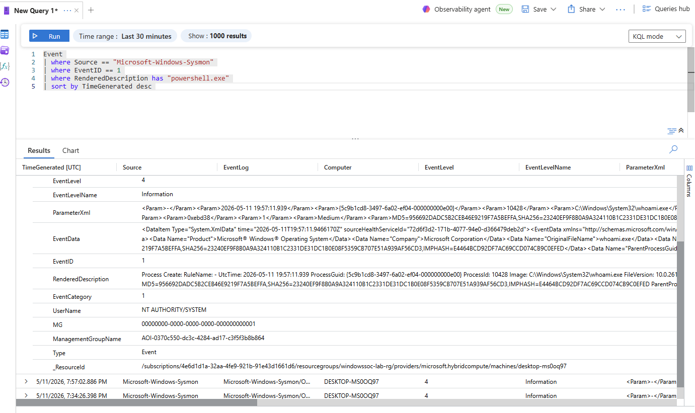

# PowerShell Telemetry Analysis

## Overview

This analysis investigates PowerShell-related telemetry collected using Sysmon and Microsoft Sentinel within the Windows SOC Detection Lab.

The objective was to understand how PowerShell activity appears inside centralized Windows logging pipelines and how SOC analysts can investigate suspicious execution behavior.

---

# Telemetry Source

The following telemetry sources were used during analysis:

- Sysmon Event ID 1 (Process Creation)
- Microsoft Sentinel
- Azure Monitor Agent
- KQL Queries

---

# Investigation Query

The following KQL query was used to investigate PowerShell execution activity:

```kql
Event
| where Source == "Microsoft-Windows-Sysmon"
| where EventID == 1
| where RenderedDescription has "powershell.exe"
| sort by TimeGenerated desc
```

---

# Investigation Screenshot



---

# Observed Telemetry

The investigation identified:
- powershell.exe execution activity
- spawned child processes
- command execution telemetry
- process creation events
- endpoint hostname information
- timestamps associated with execution

The analysis also confirmed that PowerShell execution generated Sysmon Event ID 1 logs successfully ingested into Microsoft Sentinel.

---

# Analyst Observations

The telemetry demonstrated that PowerShell activity can be monitored effectively using Sysmon process creation logs.

The investigation highlighted several important SOC concepts:

- Parent-child process relationships
- Command-line visibility
- Process execution tracking
- Endpoint telemetry collection
- Centralized log analysis

The investigation also showed how PowerShell can spawn additional Windows processes such as:
- whoami.exe
- conhost.exe
- Get-Process activity

These relationships are important during threat hunting and incident investigations.

---

# Investigation Outcome

The telemetry pipeline successfully captured:
- PowerShell execution
- Associated child processes
- Endpoint activity
- Process creation events

This validated:
- Sysmon configuration
- Azure Monitor ingestion
- Sentinel visibility
- KQL hunting capability

---

# MITRE ATT&CK Mapping

| Technique | Description |
|---|---|
| T1059.001 | PowerShell |

---

# Skills Demonstrated

- Threat Hunting
- Log Analysis
- KQL Querying
- Sysmon Analysis
- Process Investigation
- Microsoft Sentinel Investigation
