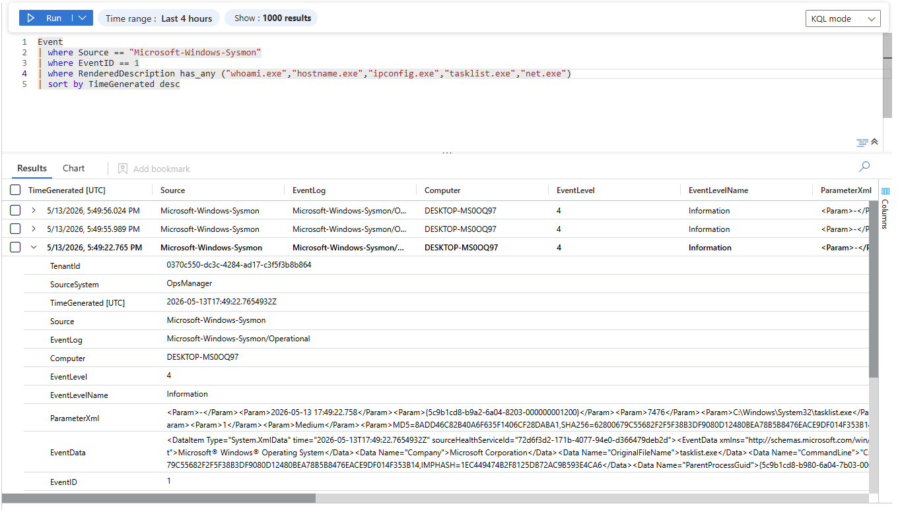

# Reconnaissance Activity Telemetry Analysis

## Overview

This investigation analyzes reconnaissance activity telemetry collected using Sysmon and Microsoft Sentinel within the Windows SOC Detection Lab.

The objective was to understand how attacker discovery behavior appears in centralized telemetry and how SOC analysts can investigate suspicious reconnaissance activity.

---

# Investigation Query

The following KQL query was used during the investigation:

```kql
Event
| where Source == "Microsoft-Windows-Sysmon"
| where EventID == 1
| where RenderedDescription has_any ("whoami.exe","hostname.exe","ipconfig.exe","tasklist.exe","net.exe")
| sort by TimeGenerated desc
```

---

# Investigation Screenshot



---

# Telemetry Observed

The investigation identified:
- whoami.exe execution
- hostname.exe execution
- ipconfig.exe execution
- tasklist.exe execution
- net.exe execution
- process creation telemetry
- command-line visibility
- parent-child process relationships

The telemetry confirmed that Sysmon Event ID 1 successfully captured reconnaissance activity.

---

# Important Telemetry Fields

## Image

The `Image` field identified reconnaissance-related executables including:
- whoami.exe
- hostname.exe
- ipconfig.exe
- tasklist.exe
- net.exe

These commands are commonly executed during post-exploitation discovery activity.

---

## Command-Line Visibility

The command-line telemetry exposed the exact reconnaissance commands executed from PowerShell.

This visibility is valuable because attackers frequently use native Windows utilities to avoid detection.

---

## Parent-Child Process Relationship

The telemetry revealed:

```text
powershell.exe
```

spawning multiple reconnaissance commands.

This parent-child process relationship is highly valuable because PowerShell-driven discovery behavior is commonly associated with:
- attacker enumeration
- hands-on-keyboard activity
- post-exploitation reconnaissance
- environment discovery

---

## User Context

The investigation identified the user responsible for executing reconnaissance commands.

User context is important during:
- incident response
- attribution analysis
- suspicious activity investigations
- insider threat analysis

---

# Analyst Observations

The investigation demonstrated several important SOC concepts:

- Legitimate administrative commands may become suspicious depending on context
- Behavioral chaining is important during investigations
- Process correlation improves detection quality
- Sequential discovery activity may indicate attacker behavior

The telemetry exposed a clear behavioral chain:

```text
powershell.exe
    ↓
whoami.exe
    ↓
hostname.exe
    ↓
ipconfig.exe
    ↓
tasklist.exe
    ↓
net.exe
```

This type of sequential discovery activity is commonly observed during:
- initial post-exploitation activity
- attacker situational awareness
- lateral movement preparation
- privilege escalation reconnaissance

---

# Investigation Outcome

The telemetry pipeline successfully captured:
- reconnaissance commands
- process execution activity
- PowerShell-spawned discovery behavior
- command-line telemetry
- behavioral activity chains

This validated:
- Sysmon process monitoring
- Sentinel ingestion
- behavioral visibility
- reconnaissance detection capability

---

# MITRE ATT&CK Mapping

| Technique | Description |
|---|---|
| T1033 | System Owner/User Discovery |
| T1082 | System Information Discovery |
| T1016 | System Network Configuration Discovery |
| T1057 | Process Discovery |
| T1087 | Account Discovery |

---

# Skills Demonstrated

- Threat Hunting
- Reconnaissance Analysis
- Process Correlation
- Behavioral Analytics
- Sysmon Analysis
- Microsoft Sentinel
- KQL Querying
- SOC Investigation
