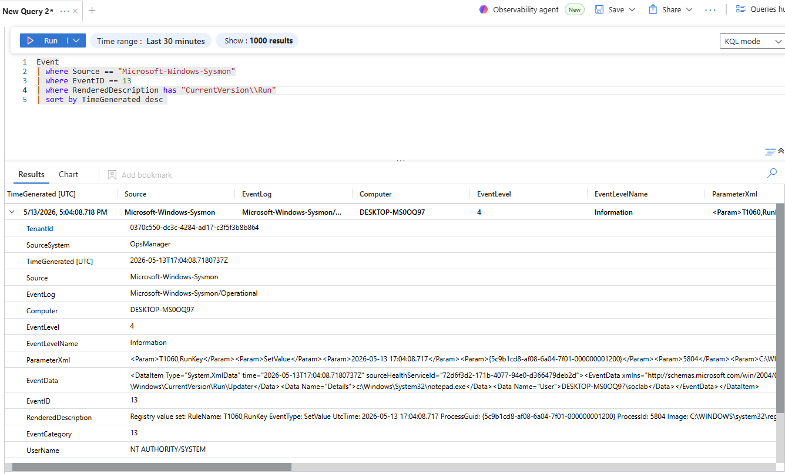

# Registry Persistence Telemetry Analysis

## Overview

This investigation analyzes Windows Registry Run Key persistence telemetry collected using Sysmon and Microsoft Sentinel within the Windows SOC Detection Lab.

The objective was to understand how registry-based persistence activity appears in centralized telemetry and how SOC analysts can investigate suspicious registry modifications.

---

# Investigation Query

The following KQL query was used during the investigation:

```kql
Event
| where Source == "Microsoft-Windows-Sysmon"
| where EventID == 13
| where RenderedDescription has "CurrentVersion\\Run"
| sort by TimeGenerated desc
```

---

# Investigation Screenshot



---

# Telemetry Observed

The investigation identified:
- Registry Run Key modifications
- Persistence value creation
- Registry path activity
- Startup persistence configuration
- User context information
- Process metadata
- Registry value details

The telemetry confirmed that Sysmon Event ID 13 successfully captured registry persistence behavior.

---

# Important Telemetry Fields

## RenderedDescription

The `RenderedDescription` field exposed:
- Registry persistence path
- Registry value creation
- Persistence configuration details

The investigation identified:

```text
HKCU\Software\Microsoft\Windows\CurrentVersion\Run\Updater
```

This confirmed Run Key persistence creation.

---

## Details

The `Details` field revealed the payload configured for automatic execution:

```text
C:\Windows\System32\notepad.exe
```

This field is important because attackers commonly configure malware payloads in registry persistence entries.

---

## User Context

The telemetry also identified the user responsible for creating the persistence entry.

User context is valuable during:
- incident triage
- attribution analysis
- insider threat investigations
- privilege investigations

---

## Registry Modification Visibility

The investigation demonstrated that Sysmon registry monitoring provides detailed visibility into:
- persistence creation
- registry value changes
- startup configuration modifications
- post-exploitation activity

---

# Analyst Observations

The investigation highlighted several important SOC concepts:

- Registry activity generates significant background noise
- Detection tuning is critical for reducing false positives
- Persistence-related registry paths are high-value hunting targets
- Behavioral detection is more effective than simple signatures

The initial broad query produced excessive telemetry, but tuning the detection specifically for:

```text
CurrentVersion\Run
```

dramatically improved detection quality.

This demonstrated how SOC analysts refine detections to balance:
- visibility
- accuracy
- operational usefulness

---

# Investigation Outcome

The telemetry pipeline successfully captured:
- Registry persistence creation
- Run Key modifications
- Persistence payload configuration
- Registry value details

This validated:
- Sysmon registry monitoring
- Sentinel ingestion
- Registry telemetry visibility
- Persistence detection capability

---

# MITRE ATT&CK Mapping

| Technique | Description |
|---|---|
| T1547.001 | Registry Run Keys / Startup Folder |

---

# Skills Demonstrated

- Threat Hunting
- Registry Analysis
- Persistence Investigation
- KQL Querying
- Sysmon Analysis
- Microsoft Sentinel
- Detection Tuning
- Behavioral Analysis
