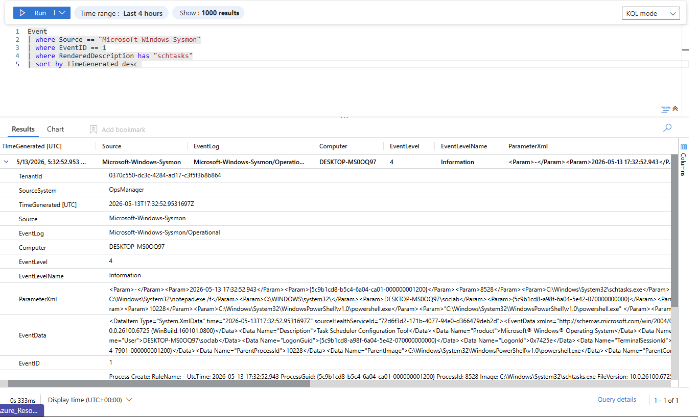

# Scheduled Task Persistence Telemetry Analysis

## Overview

This investigation analyzes scheduled task persistence telemetry collected using Sysmon and Microsoft Sentinel within the Windows SOC Detection Lab.

The objective was to understand how scheduled task persistence activity appears in centralized telemetry and how SOC analysts can investigate suspicious scheduled task creation behavior.

---

# Investigation Query

The following KQL query was used during the investigation:

```kql
Event
| where Source == "Microsoft-Windows-Sysmon"
| where EventID == 1
| where RenderedDescription has "schtasks"
| sort by TimeGenerated desc
```

---

# Investigation Screenshot



---

# Telemetry Observed

The investigation identified:
- schtasks.exe execution
- scheduled task creation activity
- persistence configuration
- onlogon task triggers
- command-line arguments
- process metadata
- parent-child process relationships
- user context information

The telemetry confirmed that Sysmon Event ID 1 successfully captured scheduled task persistence behavior.

---

# Important Telemetry Fields

## Image

The `Image` field identified the executed binary:

```text
C:\Windows\System32\schtasks.exe
```

This confirmed that Windows Task Scheduler functionality was used to establish persistence.

---

## Command-Line Visibility

The command-line telemetry exposed:

```text
/create
/sc onlogon
UpdaterTask
notepad.exe
```

This clearly identified:
- task creation behavior
- persistence trigger configuration
- scheduled payload execution

Command-line visibility is extremely valuable because attackers frequently hide malicious persistence inside legitimate Windows utilities.

---

## Parent-Child Process Relationship

The telemetry also revealed:

```text
powershell.exe
```

launching:

```text
schtasks.exe
```

This parent-child relationship is highly valuable during investigations because PowerShell-driven persistence activity is commonly associated with:
- post-exploitation behavior
- attacker automation
- malware deployment
- persistence establishment

---

## User Context

The investigation identified the user responsible for creating the scheduled task.

User context is important during:
- incident response
- attribution analysis
- suspicious activity investigations
- privilege escalation analysis

---

# Analyst Observations

The investigation demonstrated several important SOC concepts:

- Administrative tools can be abused for persistence
- Legitimate Windows binaries may become malicious depending on context
- Parent-child process relationships are critical during investigations
- Behavioral detections are stronger than simple signatures

The telemetry exposed a clear persistence workflow:

```text
powershell.exe
    ↓
schtasks.exe
    ↓
scheduled task persistence creation
```

This type of behavioral chaining is commonly used during real-world SOC investigations.

---

# Investigation Outcome

The telemetry pipeline successfully captured:
- scheduled task creation
- persistence trigger configuration
- process execution details
- command-line arguments
- persistence-related activity

This validated:
- Sysmon process monitoring
- Sentinel ingestion
- command-line visibility
- persistence detection capability

---

# MITRE ATT&CK Mapping

| Technique | Description |
|---|---|
| T1053.005 | Scheduled Task |

---

# Skills Demonstrated

- Threat Hunting
- Persistence Investigation
- Scheduled Task Analysis
- Sysmon Analysis
- Microsoft Sentinel
- KQL Querying
- Behavioral Analysis
- Process Correlation
